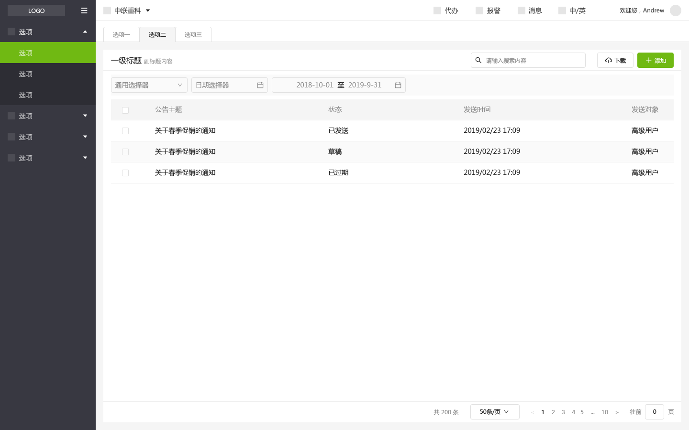
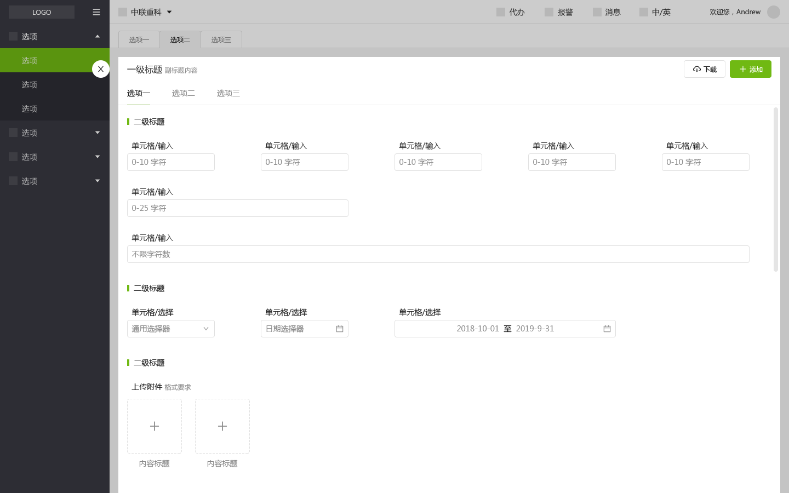

# 介绍

<!-- {.md} -->

---

<!-- {.md} -->

基于 element-ui 封装，基本保留 element-ui 组件的属性、方法和插槽。使用前先熟悉 element-ui 组件的相关用法

<!-- {.md} -->

## 特性

<!-- {.md} -->

- 基于电脑端 UI 规范和 element-ui 组件，定制的一套 UI 组件库

<!-- {.md} -->

## UI规范图

<!-- {.md} -->

<!-- {.md} -->